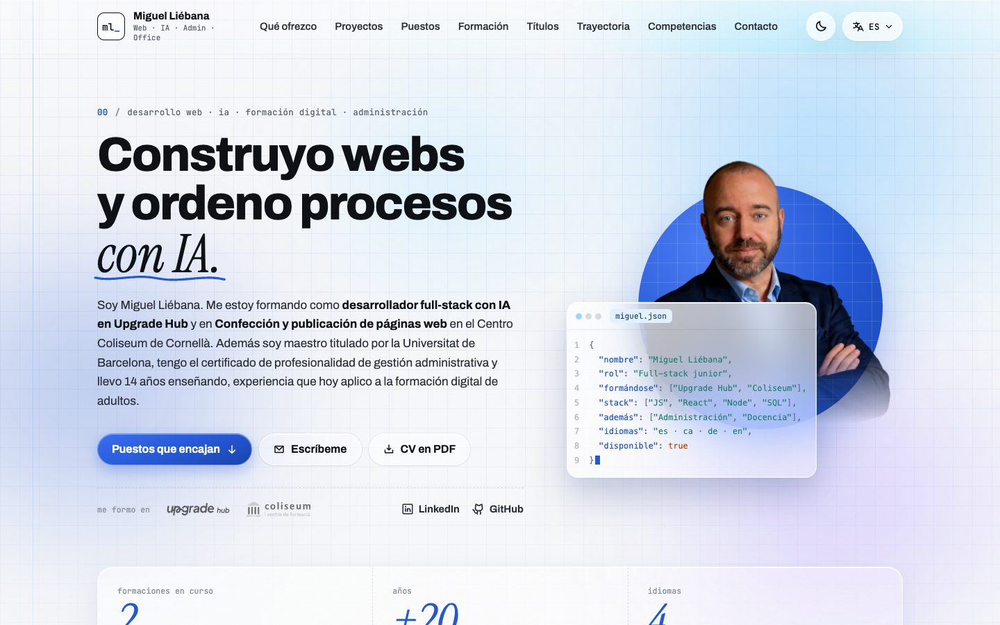

# miguelliebana.com

**Mi portfolio profesional: desarrollo web, formación digital y administración, en cuatro idiomas.**

[miguelliebana.com](https://www.miguelliebana.com)



## Qué incluye

- **Cuatro idiomas** (español, catalán, alemán e inglés) con rutas por idioma, textos en diccionarios tipados y selector
  de idioma.
- **Proyectos, puestos a los que encajo, formación, archivo de títulos** (con enlaces de verificación) y trayectoria,
  todo generado a partir de datos (`lib/cv.ts`, `lib/diplomas.ts`).
- **Tema claro y oscuro**, animaciones con GSAP que se desactivan con «reducir movimiento» y vídeo de bienvenida.
- **Accesibilidad**: navegación por teclado, enlace para saltar al contenido, textos alternativos y contraste cuidado.
- **SEO**: datos estructurados (Person, ProfilePage), sitemap y robots, e imagen para compartir generada por idioma.
- **Tests** con el ejecutor de Node (`npm test`): comprueban medios, proyectos, SEO y navegación.

## Stack

Next.js 16 (App Router) · React 19 · TypeScript · GSAP · Phosphor Icons · Vercel

## Cómo está organizado

| Carpeta | Qué contiene |
| --- | --- |
| `app/[lang]` | La página en cada idioma, su layout y la imagen para compartir |
| `components` | Secciones e interacciones (intro, explorador de puestos y formación, archivo de títulos…) |
| `lib/dictionaries` | Los textos en los cuatro idiomas |
| `lib/cv.ts`, `lib/diplomas.ts` | Los datos: experiencia, proyectos, formación y títulos |
| `test` | Tests de contenido, SEO y navegación |

## Desarrollo

```bash
npm install
npm run dev      # http://localhost:3000
npm test         # tests
npm run typecheck
```

---

Hecho por Miguel Liébana · [LinkedIn](https://www.linkedin.com/in/mliebanavicente) · [vibecodingcoach](https://vibecoding.miguelliebana.com)
